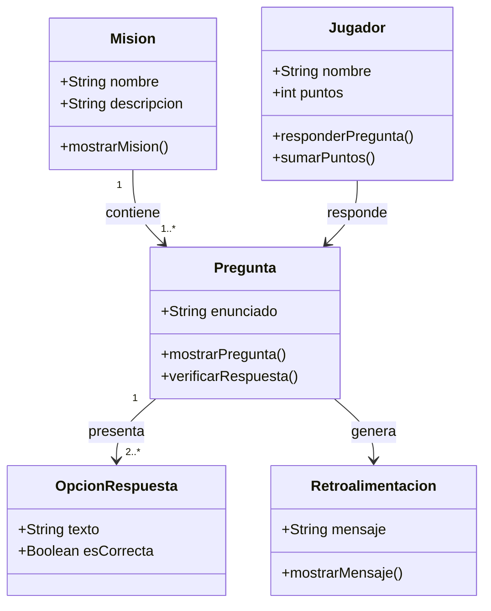

# Diagrama de clases
## Módulo de preguntas y respuestas

```mermaid
classDiagram
    class Mision {
        +String nombre
        +String descripcion
        +mostrarMision()
    }

    class Pregunta {
        +String enunciado
        +mostrarPregunta()
        +verificarRespuesta()
    }

    class OpcionRespuesta {
        +String texto
        +Boolean esCorrecta
    }

    class Jugador {
        +String nombre
        +int puntos
        +responderPregunta()
        +sumarPuntos()
    }

    class Retroalimentacion {
        +String mensaje
        +mostrarMensaje()
    }

    Mision "1" --> "1..*" Pregunta : contiene
    Pregunta "1" --> "2..*" OpcionRespuesta : presenta
    Jugador --> Pregunta : responde
    Pregunta --> Retroalimentacion : genera
```
