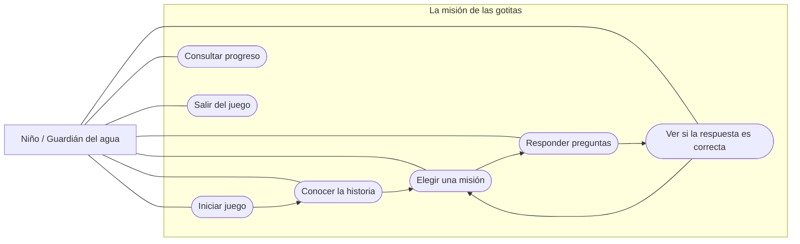

# Diagrama general de casos de uso
## Proyecto: La misión de las gotitas

```mermaid
flowchart LR
    N["Niño / Guardián del agua"]

    subgraph S["La misión de las gotitas"]
        A(["Iniciar juego"])
        B(["Conocer la historia"])
        C(["Elegir una misión"])
        D(["Responder preguntas"])
        E(["Ver si la respuesta es correcta"])
        F(["Consultar progreso"])
        G(["Salir del juego"])
    end

    N --- A
    N --- B
    N --- C
    N --- D
    N --- E
    N --- F
    N --- G

    A --> B
    B --> C
    C --> D
    D --> E
    E --> C
```
